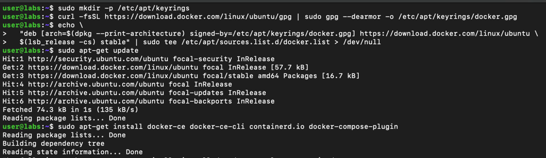
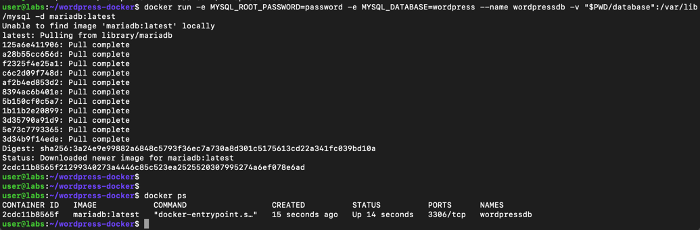
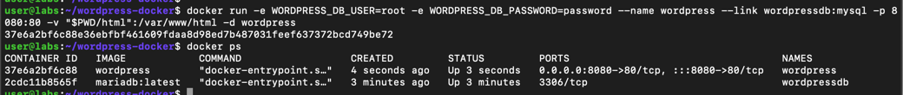
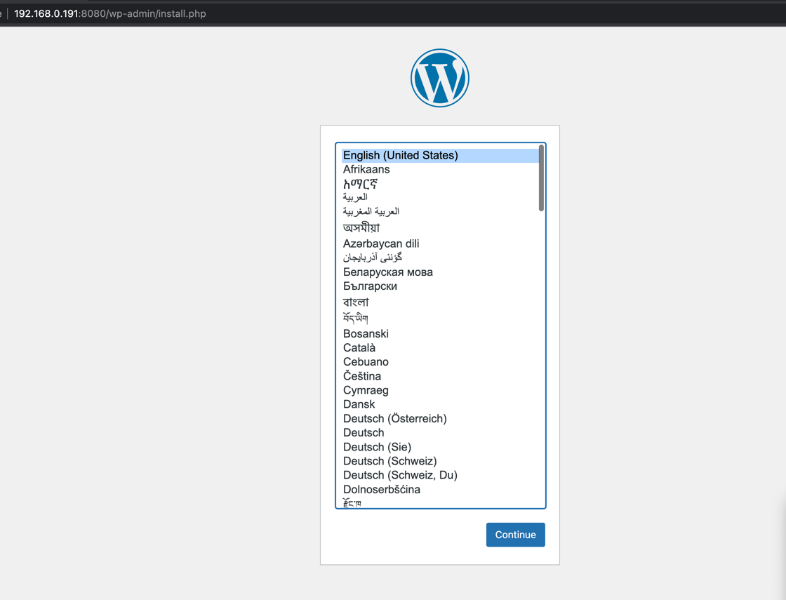

Встановлення docker

Запуск контейнера з базою даних

~~~
docker run -e MYSQL_ROOT_PASSWORD=password -e MYSQL_DATABASE=wordpress --name wordpressdb -v "$PWD/database":/var/lib/mysql -d mariadb:latest
~~~

Запуск wordpress в docker

~~~
docker run -e WORDPRESS_DB_USER=root -e WORDPRESS_DB_PASSWORD=password --name wordpress --link wordpressdb:mysql -p 8000:80 -v "$PWD/html":/var/www/html -d wordpress
~~~

